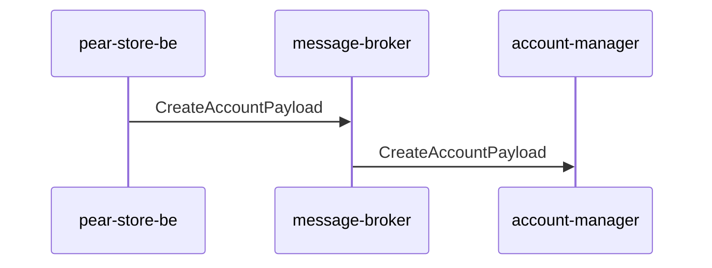

# About Me

I am a passionate programmer ready to learn new things and improve my current skills.
I use Java as my main programming language and mostly work at the back-end part of the development world, but I'm currently learning React and plan to improve my front-end skills to become an experienced full-stack developer.

## Dev Tools
[Intellij IDEA](https://www.jetbrains.com/idea/)  
[Visual Studio Code](https://code.visualstudio.com/)  
[Docker Desktop](https://www.docker.com/products/docker-desktop/) - container tool  
[pgAdmin](https://www.pgadmin.org/) - database viewer  
[Jenkins](https://www.jenkins.io/) - CI/CD  
[Argo](https://argoproj.github.io/) - K8s cluster manager  
[ElasticSearch](https://www.elastic.co/) - log tracking  
[Akhq](https://akhq.io/) - Kafka monitoring  
[Apicurio Registry](https://www.apicur.io/registry/) - Avro schema registry   
[Postman](https://www.postman.com/) - API Testing & Automation  

## Other Tools
[Obsidian](https://obsidian.md/)    
[Jira](https://www.atlassian.com/software/jirahttps://www.atlassian.com/software/jira?&aceid=&adposition=&adgroup=140448864863&campaign=18451798950&creative=656629726793&device=c&keyword=jira&matchtype=e&network=g&placement=&ds_kids=p73363375466&ds_e=GOOGLE&ds_eid=700000001558501&ds_e1=GOOGLE&gad_source=1&gclid=Cj0KCQjwqP2pBhDMARIsAJQ0CzqEG-5k9fB0v_s3Udy8Ro0He2gIZfZ3E2MWZcL9AtNzGPxQ6Evnt_saAjT2EALw_wcB&gclsrc=aw.ds)

## Languages and Frameworks
Java(SpringBoot), Javascript (React.js), Css, Html

### GitHub Projects

Following projects represents the microservices of a fictional store.\
[pear-store-fe](https://github.com/thomasdang1996/pear-store-fe)- front-end part of the application\
[pear-store-be](https://github.com/thomasdang1996/pear-store-be) - core service of the application with basic APIs\
[account-manager](https://github.com/thomasdang1996/account-manager-be) - supporting service  for managing user accounts\
[message-broker](https://github.com/thomasdang1996/message-broker) - service acting as a messaging bridge between services

Communication between the services are either via REST or Kafka messaging. Following diagram shows, how Kafka message travels through a message broker.

